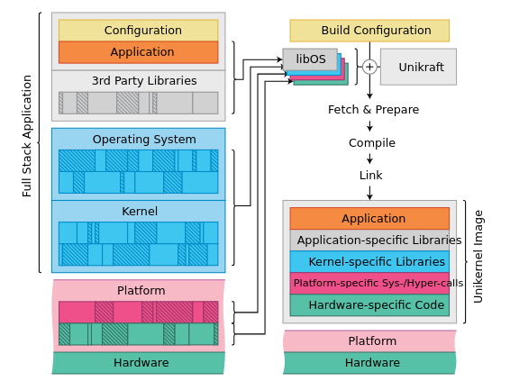
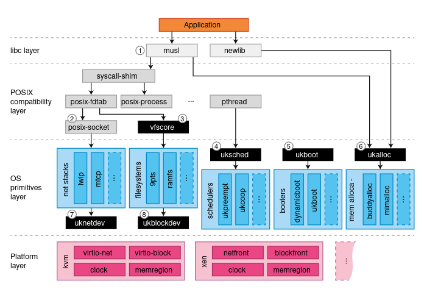

# Unikraft GSoC'22: Shadow Stack


Software based shadow stacks protect the return value of the functions by comparing what’s pushed into them with what resides in the traditional stack, practically, functioning as a backup and check storage.

The current implementation aims to bring the compiler based, LLVM `ShadowCallStack` to Unikraft apps.

What makes this project so different from other approaches is the complexity of the platform it targets.
Unikraft, a Unikernel Development Kit, provides applications that run in a single address space, which means that there is no separation between usermode and kernelmode.



Thus, traditional means of using the compiler based `ShadowCallStack` can not be applied to Unikraft images.
More exactly, providing a runtime (not yet supported by LLVM's `compiler-rt`) for this security mechanism can not follow the path of using, for instance, the `arch_prctl` syscall, very nicely documented [here](https://gist.github.com/moyix/f2e101348209ddeb7eba903147a867aa).

Moreover, what's really so interesting about Unikraft is the ability of building images for a plethora of architectures and platforms, ergo, the initial goal of my GSoC project (Shadow Stack for `AArch64` based apps) could easily come to light while maintaining separation and modularity.



Following this idea, what had to be accomplished was modifying the bootstraping process (provided by the `ukboot` internal library), by inserting a constructor, whose sole purpose was to initialize the `x18` register with the protected stack.

Nevertheless, for more complex apps, such as `SQLite`, `Redis` and `Nginx` (already ported to Unikraft), initializing `x18` means altering the scheduling implementation (found in the `uksched` and `ukschedcoop` internal libraries), as multithreading becomes the norm.

## GSoC contributor

Name: Maria Sfiraiala

Email: <maria.sfiraiala@gmail.com>

Github profile: [mariasfiraiala](https://github.com/mariasfiraiala)

## Mentors

[Razvan Deaconescu](https://github.com/razvand)

[Vlad Badoiu](https://github.com/vladandrew)

## Main Contributions

The biggest part of my work went into crafting the **[Shadow Stack PR](https://github.com/unikraft/unikraft/pull/505)**, which should be upstream once the `0.12 Epimetheus` Unikraft release is out.

This PR aims to bring Shadow Stack support to both single threaded and multithreading apps, even though work is still pending in order to fix some bugs regarding the multithreading Shadow Stack implementation.

## Sidequests

Besides providing the aforementioned PR, critical to the full integration of my work was ensuring that the most used complex apps on the `AArch64` architecture were functional.

This matrix, which can also be found [here](https://github.com/mariasfiraiala/scs-work/blob/master/unikraft-scs/unikraft-scs-for-complex-apps.md)


| App\Compiler | gcc - x86 | gcc - aarch64 | clang - x86 | clang - aarch64 | clang with scs | gcc-12 with scs |
|--------------|-----------|---------------|-------------|-----------------|----------------|-----------------|
| SQLite | :heavy_check_mark: | :heavy_check_mark: | :heavy_check_mark: | :heavy_check_mark: | :soon: | :soon: |
| redis | :heavy_check_mark: | :heavy_check_mark: | :heavy_check_mark: | :heavy_check_mark: | :soon: | :soon: |
| nginx | :heavy_check_mark: | :heavy_check_mark: | :heavy_check_mark: | :heavy_check_mark: | :soon: | :soon: |

perfectly describes the efforts made into that direction.

### PRs opened by me

* [Redis documentation PR](https://github.com/unikraft/app-redis/pull/6)

* [Newlib PR](https://github.com/unikraft/lib-newlib/pull/21)

* [Core Unikraft TLS PR](https://github.com/unikraft/unikraft/pull/513)

* [Lwip PR](https://github.com/unikraft/lib-lwip/pull/18)


### PRs reviewed by me

* [Core Unikraft alignment PR](https://github.com/unikraft/unikraft/pull/530)

* [Compiler-rt PR](https://github.com/unikraft/lib-compiler-rt/pull/5)

* [Redis PR](https://github.com/unikraft/lib-redis/pull/6)

* [Python3 PR](https://github.com/unikraft/lib-python3/pull/6)

* [Core Unikraft boot stack alignment PR](https://github.com/unikraft/unikraft/pull/533)

### Issues opened by me

* [Newlib limits.h issue](https://github.com/unikraft/lib-newlib/issues/19)

* [Newlib fcntl.h issue](https://github.com/unikraft/lib-newlib/issues/20)

* [Core Unikraft TLS issue](https://github.com/unikraft/unikraft/issues/514)

* [Core Unikraft virtio issue](https://github.com/unikraft/unikraft/issues/518)

* [Core Unikraft nested macros issue](https://github.com/unikraft/unikraft/issues/532)

### Unikraft Summer of Code 2022

[Unikraft Summer of Code](https://unikraft.org/community/hackathons/usoc22/) is a unikernel and library OS workshop held every summer by the Unikraft community.

My contributions revolved around both reviewing and updating last year's content for the [Complex Applications session](https://unikraft.org/community/hackathons/usoc22/complex-applications/) and testing the content for the [Contributing to Unikraft session](https://unikraft.org/community/hackathons/usoc22/contributing-to-unikraft/).

For a better grasp of the work that went into it, check these 2 PRs:

* [Complex Applications PR](https://github.com/unikraft/docs/pull/102)

* [Contributing to Unikraft PR](https://github.com/unikraft/docs/pull/96)

## Roadmap

My journey for the second part of the GSoC mentorship was documented [here](https://github.com/mariasfiraiala/scs-work/blob/master/utils/roadmap-scs.md).

For more detailed timestamps you can check our meeting notes in the Unikraft meeting notes [repo](https://github.com/unikraft/meeting-notes/tree/staging/discussions/gsoc); look for the files with the `ss` prefix (acronym for Shadow Stack).

## Blog posts

During GSoC'22, I provided 3 blog posts which offer a comprehensive status quo for the 3 months that I was involved with Unikraft:

* [first blog post](https://unikraft.org/blog/2022-07-05-unikraft-gsoc-shadow-stack/)

* [second blog post](https://unikraft.org/blog/2022-07-20-unikraft-gsoc-shadow-stack/)

* [third blog post](https://unikraft.org/blog/2022-08-19-unikraft-gsoc-shadow-stack/)

## Documentation

Documenting each and every step I took this summer was also one of my favourite activities.

The main 3 documents that highlight this passion are:

* [Shadow Stack for ARM vs x86](https://github.com/mariasfiraiala/scs-work/blob/master/utils/doc-scs-arm-vs-x86.md)

* [Shadow Stack for simple apps on Unikraft](https://github.com/mariasfiraiala/scs-work/blob/master/unikraft-scs/unikraft-scs-for-helloworld.md)

* [Shadow Stack for complex apps on Unikraft](https://github.com/mariasfiraiala/scs-work/blob/master/unikraft-scs/unikraft-scs-for-complex-apps.md)

## Current status

My project, even though it followed the initial proposal quite accurately, provides Shadow Stack support for apps without multithreading.

To be more exact, already implemented Unikraft apps, such as `helloworld`, or any user imported programs that do not use what, in the Unikraft realm, is considered [multithreading](https://unikraft.org/blog/2022-06-27-unikraft-synchronization/#mutex) work with Shadow Stack support.

As Proof of Concept, I relied on inspecting assembly code using `gdb`:


```
main (argc=1, argv=0x4013c3d0 <ukplat_entry_argp.argv>)
    at /home/maria/demo/02-hello-world-with-shadow-stack/apps/app-helloworld/main.c:27
27      {
(gdb) x/i $pc
=> 0x40108590 <main>:   str     x30, [x18], #8
(gdb) si
0x0000000040108594      27      {
(gdb) x/i $pc
=> 0x40108594 <main+4>: stp     x29, x30, [sp, #-48]!
(gdb) x/x $x18
0x47fc0018:     0x00000000
(gdb) x/x $x30
0x40113c78 <main_thread_func+380>:      0x7100001f
(gdb) x/x 0x47fc0010
0x47fc0010:     0x40113c78
```

Notice how [`x18` - 8] stores pointer to `x30`, which at this point in time has the return address.

## Future work

The first milestone to be achieved after GSoC'22 comes to an end is having multithreading Shadow Stack support.

Beautifying and easing the `make build` system for apps for which Unikraft users would like to have Shadow Stack support is also a top priority.

Reviewing current work done by the community towards modifying the [scheduling API](https://github.com/skuenzer/unikraft/tree/skuenzer/sched-refactor) and updating my implementation to fit these changes takes a big part in my planning for the future 2-3 months.

Nevertheless, investigating other security mechanisms related to Shadow Stack (such as `CET` and `Safe Stack`) and providing proposals as to how they would be integrated into the Unikraft ecosystem seems to be critical to [Unikraft's security](https://unikraft.org/docs/features/security/), as it heavily relies on the isolation provided by running images in a virtualized medium, without any other significant security mechanisms being involved.

As a part of my testing work, I also plan on continuing to test Unikraft apps on `AArch64` with various compilers. Some of these apps are: [`app-python3`](https://github.com/unikraft/app-python3), [`app-lua`](https://github.com/unikraft/app-lua), [`app-httpreply`](https://github.com/unikraft/app-httpreply).

Another thing which should also be achieved is providing a series of patches for `newlib` in order to fix some `gcc`-isms that, for the time being, make the compilation of `AArch64` apps impossible using `clang`.

## Main takeaways

### Soft skills

The achievement I am the proudest about is the easiness with which I, now, ask questions. Luckily, I've come to the conclusion that, mostly, people don't bite and having trouble and asking for help isn't such a sin.

The other accomplishment with which I'm also very happy is the integration among the other members of the community. I am now accustomed with everyone's role in the organization, what are the current tasks carried out by the team, what work is being done at the moment, who to ask about a particular bug. In other words, I've found my place.

### Hard skills

Technologies I got accustomed with:

<div>
  &nbsp;
  &nbsp;
  &nbsp;
  &nbsp;
  &nbsp;
  &nbsp;
  &nbsp;
  &nbsp;
</div>

### Final thoughts

My forever gratitude goes towards my mentors, [Razvan](https://github.com/razvand) and [Vlad](https://github.com/vladandrew) as they truly embodied what a mentor should be. Without them my project wouldn't have been as fun and as close to an end as it is now.

Many thanks to the people that also looked after me, [Radu](https://github.com/RaduNichita), [Eduard](https://github.com/eduardvintila), [Stefan](https://github.com/StefanJum) and [Cezar](https://github.com/craciunoiuc).

To the rest of the community I pestered with issues and stupid questions, [Michalis](https://github.com/michpappas), [Marc](https://github.com/marcrittinghaus), [Simon](https://github.com/skuenzer) and [Robert](https://github.com/kubanrob), my sincere apologies and thank you for your patience and willingness to help.