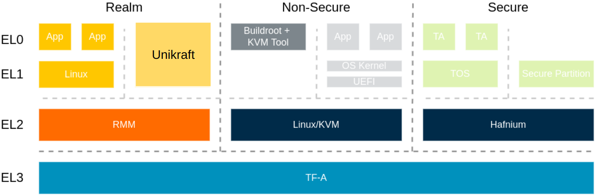

# Arm CCA Support for Unikraft

## GSoC Contributor

* **Name:** Xingjian Zhang
* **Email:** zhxj9823@gmail.com
* **Github profile:** [@zhxj9823](https://github.com/zhxj9823/)

## Mentors

* [Michalis Pappas](https://github.com/michpappas)
* [Hugo Lefeuvre](https://github.com/hlef)
* [Răzvan Vîrtan](https://github.com/razvanvirtan)
* [Maria Sfîrăială](https://github.com/mariasfiraiala)
* [Vlad Bădoiu](https://github.com/vladandrew)

## Contributions

### Project Description

[Arm CCA](https://www.arm.com/architecture/security-features/arm-confidential-compute-architecture) introduces the Realm Management Extension (RME), which extends [Arm TrustZone technology](https://www.arm.com/technologies/trustzone-for-cortex-a) with two new security states: the `realm` state and the `root` state.
Instead of running a VM in the normal world, the CCA can run a VM in the realm state.
The realm state constructs protected execution environments called realms, which protect the data in the realms from other components.
This architecture allows the hypervisor to control the VM but removes the right for access to that VM.
The following figure shows the system architecture of Arm CCA.
**The primary goal of this project is to bring Arm CCA support to Unikraft, so it can run as a realm VM.**

### Arm CCA Support for Unikraft

The main contributions of this project are in [PR #964](https://github.com/unikraft/unikraft/pull/964), which adds necessary modifications to Unikraft to support Arm CCA.
The work can be categorized into three main parts.

#### Changes to the Bootflow

To use Unikraft in the realm world, we need to make some changes to the bootflow.
The changes include the detection of RSI interfaces, setup of the realm memory region, and the marking of device memory regions as unprotected.

#### Implementing `ukrsi`

The latest [Realm Management Monitor specification](https://developer.arm.com/documentation/den0137/latest/) specifies the RSI commands, which provide certain functionalities for the realm VM.
A new `ukrsi` under `drivers/arm-cca` implements all these commands:

* `RSI_ATTESTATION_TOKEN_CONTINUE`
* `RSI_ATTESTATION_TOKEN_INIT`
* `RSI_HOST_CALL`
* `RSI_IPA_STATE_GET`
* `RSI_IPA_STATE_SET`
* `RSI_MEASUREMENT_EXTEND`
* `RSI_MEASUREMENT_READ`
* `RSI_REALM_CONFIG`
* `RSI_VERSION`

#### Application Compatibility

To demonstrate the use of Unikraft in the realm world, we bring several applications to the realm world.
Launching an application in the realm world uses kvmtool, so we need to make applications compatible with kvmtool and the realm world.
Currently, `app-helloworld`, `app-sqlite`, `app-httpreply`, `app-redis` can work with kvmtool.
These applications leverage various devices, including the serial console, the `initrd` filesystem, and the networking device.
Besides, `app-helloworld` and `app-sqlite` with initrd can work in the realm world, while other applications require additional support.

### Other PRs

In addition to my main contribution of bringing Arm CCA support to Unikraft, I also contributed to other PRs in the Unikraft repository.
These PRs address issues that I encountered when trying to make applications compatible with kvmtool.

#### Merged PRs

* [PR #970](https://github.com/unikraft/unikraft/pull/970) fixes an issue relating to unaligned read and write operations in `virtio_mmio`.
* [PR #985](https://github.com/unikraft/unikraft/pull/985) adds two configurations to `ns16550`, so the serial driver can suit more use cases.
* [PR #1059](https://github.com/unikraft/unikraft/pull/1059) swaps the last two arguments of `virtio_9p_feature_negotiate`'s first call to `virtio_config_get`.

#### Pending PRs

* [PR #986](https://github.com/unikraft/unikraft/pull/986) migrates console APIs into a new `libuktty`.

## Blog Posts

- [First blog post](https://unikraft.org/blog/2023-06-23-unikraft-gsoc-arm-cca-1/)
- [Second blog post](https://github.com/unikraft/docs/pull/287)
- [Third blog post](https://github.com/unikraft/docs/pull/301)
- [Forth blog post](https://github.com/unikraft/docs/pull/310)

## Documentation

A more detailed documentation of `ukrsi` is in `drivers/arm-cca/ukrsi/README.md`, which decribes the implementation of `ukrsi` and how to use it.

## Current Status

The table below summarizes the compatibility of applications with different environments.
Three environments are considered: applications running in a native ARM64 machine using kvmtool, applications running in the normal world on FVP, and applications running in the realm world on FVP.

| Applications                                                          | native kvmtool    | kvmtool in FVP    | Realm world   |
|--------------------------------------------------------------------   |:--------------:   |:--------------:   |:-----------:  |
| [`app-helloworld`](https://github.com/unikraft/app-helloworld)        |        Y          |        Y          |      Y        |
| [`app-httpreply`](https://github.com/unikraft/app-httpreply)          |        Y          |        N          |      N        |
| [`app-sqlite`](https://github.com/unikraft/app-sqlite) with initrd    |        Y          |        Y          |      Y        |
| [`app-sqlite`](https://github.com/unikraft/app-sqlite) with 9pfs      |        Y          |        Y          |      N        |
| [`app-redis`](https://github.com/unikraft/app-redis)                  |        Y          |        N          |      N        |

## Future Work

While, my GSoC project journey is coming to an end, my work on Arm CCA support for Unikraft is not.
As some applications do not work in the realm world, I will continue to work on making them work.
Besides, as the Arm CCA technology continues to evolve, I will continue to improve its support for Unicraft.

## Acknowledgements

Thanks to all my mentors and the Unikraft community for their guidance and support.
