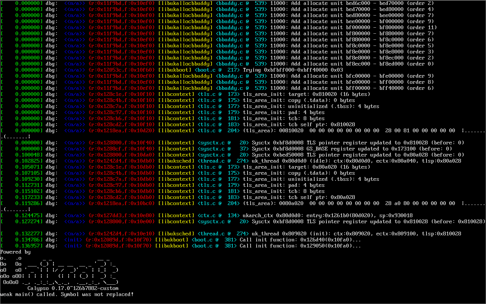

# Unikraft GSoC'24: UEFI Graphics Output Protocol Support in Unikraft.

Unikraft's ability to print logs to the screen is quite limited, which makes it harder to debug it during development.
While it is entirely possible to use the serial port console instead of a screen, it is not as easily accessible or available on usual consumer machines.

The widely available and standardized [UEFI Graphics Output Protocol](https://uefi.org/specs/UEFI/2.10/12_Protocols_Console_Support.html#efi-graphics-output-protocol) (GOP) interface is an excellent candidate.

The UEFI GOP interface allows us to query for a framebuffer, which is an array of pixels in memory.
Setting the color value of the pixels in the framebuffer will set the colors of the corresponding pixels on the screen, thus enabling graphic output.

This project aims to implement a UEFI GOP based console.
This would directly allow Unikraft to be easier debugged on UEFI-based systems and fast track the development of x86_64 baremetal machine support.

## GSoC Contributor

- Name: Sriprad Potukuchi
- Email: <sripradp@proton.me>
- GitHub profile: [procub3r](https://github.com/procub3r)

## Mentors

- [Sergiu Moga](https://github.com/mogasergiu)
- [Răzvan Vîrtan](https://github.com/razvanvirtan)
- [Michalis Pappas](https://github.com/michpappas)

## Contributions

My main contribution is [PR #1448](https://github.com/unikraft/unikraft/pull/1448), which creates a UEFI GOP device driver in `drivers/uktty/gop`.

This driver first locates and queries the UEFI Graphics Output Protocol for a framebuffer.
It also queries some metadata about the framebuffer such as its width, height and total size.
It then calculates the number of rows and columns of printable characters based on this metadata and the dimensions of a single character from the configured bitmap font.

Upon receiving a message to print, the driver first parses any ANSI escape sequences within the message to format the output text.
Then, for every printable character in the message, it performs a lookup in the bitmap font to determine the exact pixels to render and renders them with the appropriate formatting.

The driver also supports scrolling when the console output is full.
This is to ensure that the latest output is always visible on the console.

### The `ukconsole` Dependency

`ukconsole` is a generic console device interface which allows device drivers (GOP, VGA, COM etc) to register themselves as console devices.
All prints and reads in the the kernel go to these registered devices through the `ukconsole` interface.

The GOP device driver introduced in this project is one such device driver which registers itself with `ukconsole`.

At the time of writing, `ukconsole`, introduced in [PR #1464](https://github.com/unikraft/unikraft/pull/1464) is yet to be merged.
My work with the GOP driver can be upstreamed as soon as the `ukconsole` PR is merged!

## Blog Posts

- [Part 1](https://github.com/unikraft/docs/pull/430): Initializing GOP and implementing a proof of concept.
- [Part 2](https://github.com/unikraft/docs/pull/441): Parsing and rendering a bitmap font.
- [Part 3](https://github.com/unikraft/docs/pull/450): Arbitrary bitmap font support and migrating to `ukconsole`.
- [Part 4](https://github.com/unikraft/docs/pull/454): Coloring logs with ANSI escape codes.

## Current Status

The UEFI GOP console works as expected!
Here's a screenshot of it in action:

_Unikraft kernel logs printed to display using the UEFI GOP console._

## Future Work

Currently, the graphics mode being used is the default one returned by UEFI GOP.
We could instead iterate through all the available modes and pick the most suitable one for the given display.

To take this further, the bitmap font can be scaled fractionally to be of appropriate size to perfectly fit within the display.
This would entail the usage of some clever techniques such as anti-aliasing.

The scope of this project was to introduce a driver that supports console output only.
It would be really cool to make it an interactive console by supporting console input too!

## Acknowledgements

The Unikraft community has been extremely welcoming.
I would like to thank my mentors and the amazing folk part of this community for their continued support.
This work would not have been possible without them! :heart:
